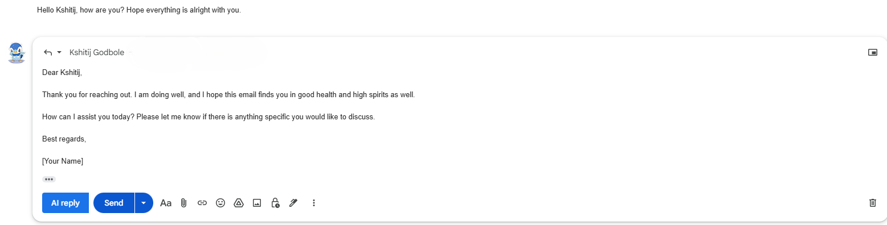

Today 11:21 PM
Pasted text(20260921-182424).txt
Document
Pasted text(20260921-185916).txt
Document

Yep, I can see it now. 👍

Your Environment Variables window has:

GEMINI_API_KEY
GEMINI_API_URL

That part is correct. The values are hidden, so I can't tell from this screenshot what GEMINI_API_URL actually contains.

The important thing is: we need to inspect the value of GEMINI_API_URL.

Do this

In that Environment Variables window:

Double-click the row GEMINI_API_URL.
Look at its Value.
If it says something like:
http://localhost:8080/api/email/generate

❌ That's the problem.

It should be the Gemini API endpoint, not your own Spring Boot endpoint.

Also, don't send me the GEMINI_API_KEY value. You can safely show me the URL value.

One important correction

I don't want you to change anything yet based solely on the previous screenshot. Your current screenshot confirms the variable exists, but it doesn't show its value.

So just send me a screenshot after opening/editing GEMINI_API_URL, with the API key still hidden.

Then I'll tell you exactly what to put there.

Pasted text(20260921-191751).txt
Document
Pasted text(20260921-193008).txt
Document
Pasted text(20260921-193803).txt
Document
README.md
File
how is this README.md

Absolutely. Let's improve the README we built together, not replace it with that other uploaded version.

I’d keep the current structure but make it more professional, accurate, and recruiter-friendly. In particular, we'll make sure it reflects what you've actually implemented: Gemini integration, tone selection, React frontend, Chrome extension, environment variables, and WebClient.

And we'll still do it one step at a time.

Step 1 — Improve the title and description

Open your current README.md.

Replace the first two lines:

# AI Email Writer

An AI-powered email assistant that generates professional email replies based on the email content and selected tone.

with:

# AI Email Writer

An AI-powered email assistant that generates professional email replies based on email content and a selected tone. The application combines a Spring Boot REST API, React frontend, Chrome extension, and Google Gemini API to provide AI-assisted email drafting.

This is better because it immediately tells someone what the project does and what technologies are involved, without making the description unnecessarily long.

Save it with Ctrl + S.

Tell me when that's done, and we'll improve the Features section next.

do you think should i change my project name

I’d keep the project name AI Email Writer for now.

It’s simple, clear, and immediately tells a recruiter what the project is. You don't gain much by making it something flashy like MailGenAI or SmartMail AI.

That said, there is one naming distinction worth considering:

AI Email Writer → broader, clean, good for a portfolio
AI Email Reply Generator → more precise about what your application actually does
AI Email Assistant → sounds broader, but could imply features you don't currently have

For your current implementation, AI Email Writer is perfectly fine. I'd spend the effort improving the README and project itself rather than renaming it.

If we later add features like Gmail integration, email history, multiple reply styles, etc., then AI Email Assistant could make more sense.

give all README.md content all at once

Yep. Let's make it clean, accurate, and CV-friendly without making it sound like a corporate press release. 😄

Copy everything below into your README.md, replacing the current contents:

# AI Email Writer

An AI-powered email assistant that generates professional email replies based on email content and a selected tone. The application combines a Spring Boot REST API, React frontend, Chrome extension, and Google Gemini API to provide AI-assisted email drafting.

## Features

- Generate AI-powered email replies
- Select a desired tone for the generated reply
- REST API built with Spring Boot
- Google Gemini API integration
- Reactive HTTP communication using Spring WebFlux `WebClient`
- React-based frontend
- Chrome extension integration
- Environment-based API key configuration
- Simple and user-friendly interface for generating email replies

## Tech Stack

- **Backend:** Java, Spring Boot
- **API:** REST API, Spring WebFlux `WebClient`
- **AI:** Google Gemini API
- **Frontend:** React, JavaScript
- **Browser Extension:** Chrome Extension
- **Build Tool:** Maven
- **Version Control:** Git, GitHub

## Project Structure

```text
ai-email-writer/
├── email-writer/              # Spring Boot backend
├── email-writer-react/        # React frontend
├── email-writer-extension/    # Chrome extension
└── README.md
```

## How It Works

1. The user enters the content of an email and selects a desired tone.
2. The React frontend sends the request to the Spring Boot backend.
3. The Spring Boot REST API receives the email content and tone.
4. The backend builds a prompt based on the user's input.
5. `WebClient` sends the request to the Google Gemini API.
6. Gemini generates a professional email reply.
7. The backend extracts the generated response from the API response.
8. The generated reply is returned to the frontend and displayed to the user.

## Setup and Installation

### Prerequisites

- Java 17 or later
- Maven
- Node.js and npm
- Google Gemini API key

### Backend Setup

1. Clone the repository:

```bash
git clone https://github.com/Kshitiz9/ai-email-writer.git
```

2. Navigate to the backend directory:

```bash
cd ai-email-writer/email-writer
```

3. Configure the required environment variables:

```text
GEMINI_API_URL=your_gemini_api_url
GEMINI_API_KEY=your_gemini_api_key
```

Do not commit your actual Gemini API key to the repository.

4. Start the Spring Boot application:

```bash
./mvnw spring-boot:run
```

On Windows, you can use:

```bash
mvnw.cmd spring-boot:run
```

The backend runs on:

```text
http://localhost:8080
```

### Frontend Setup

1. Open a new terminal and navigate to the React application:

```bash
cd ai-email-writer/email-writer-react
```

2. Install the required dependencies:

```bash
npm install
```

3. Start the React development server:

```bash
npm run dev
```

The terminal will display the local development URL.

## API

### Generate Email Reply

**Endpoint:**

```text
POST /api/email/generate
```

**Request Body:**

```json
{
  "emailContent": "Hello, I wanted to follow up regarding our meeting.",
  "tone": "Professional"
}
```

The API processes the email content and selected tone and returns an AI-generated email reply.

## Environment Variables

The application uses environment variables to keep API credentials outside the source code.

```text
GEMINI_API_URL=your_gemini_api_url
GEMINI_API_KEY=your_gemini_api_key
```

Never commit a real API key to GitHub.

## Future Improvements

- Add authentication and user accounts
- Add email history and saved replies
- Add additional tone and writing-style options
- Add Gmail and Outlook integration
- Deploy the application to a cloud platform
- Improve error handling and API response validation
- Add automated unit and integration tests

## Screenshots



## Author

**Kshitij**

GitHub: https://github.com/Kshitiz9
